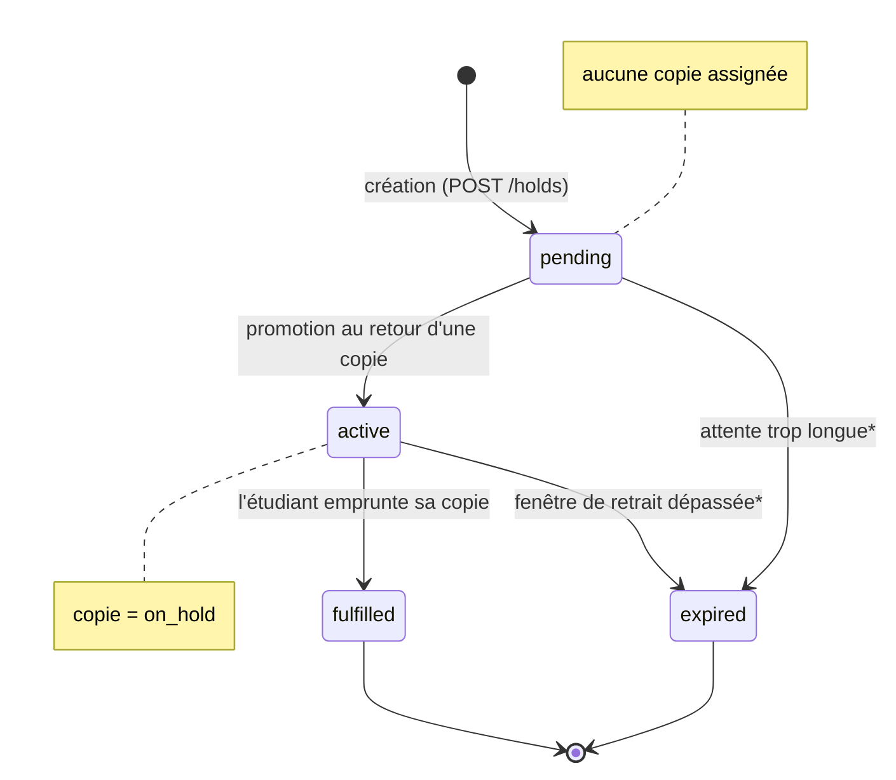
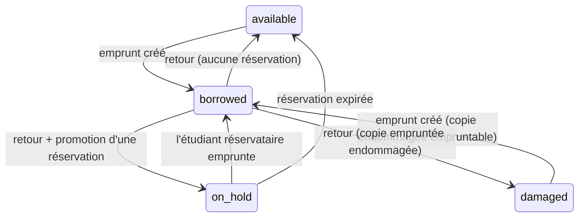

# Règles métier — Emprunts (*borrowing*) & Réservations (*hold*)

> Référence des règles qui régissent le prêt et la réservation d'un livre, et
> **le statut dans lequel se trouve la copie (`copy.status`) à chaque étape**.
>
> Les valeurs de statut (`available`, `borrowed`, `on_hold`, `pending`…) sont
> celles du code et de la base ; elles sont laissées en anglais volontairement.

---

## Table des matières

- [1. Vue d'ensemble](#1-vue-densemble)
- [2. Le statut d'une copie (`copy.status`)](#2-le-statut-dune-copie-copystatus)
- [3. Emprunts (*borrowing*)](#3-emprunts-borrowing)
- [4. Réservations (*hold*)](#4-réservations-hold)
- [5. Synchronisation de `copy.status` (les triggers)](#5-synchronisation-de-copystatus-les-triggers)
- [6. Scénarios d'interaction emprunt ↔ réservation](#6-scénarios-dinteraction-emprunt--réservation)
- [7. Constantes de temps](#7-constantes-de-temps)
- [8. Ce qui est en place vs. défini mais non branché](#8-ce-qui-est-en-place-vs-défini-mais-non-branché)

---

## 1. Vue d'ensemble

Trois mécanismes coopèrent pour maintenir la cohérence. **Savoir qui pilote quoi
est essentiel :**

| Mécanisme | Rôle | Où |
|---|---|---|
| **Triggers PostgreSQL** | Maintiennent `copy.status` en réaction aux écritures sur `borrowing` et `hold`. `copy.status` **n'est jamais écrit par le code applicatif** (sauf action manuelle « Update status »). | `sql/schema.sql` |
| **Couche service** | Porte les règles métier : conditions de prêt, retour, et **promotion** d'une réservation (car elle envoie aussi une notification). | `BorrowingServiceImpl`, `HoldServiceImpl` |
| **Scheduler** | Transitions basées sur le temps (passage en retard). | `OverdueBorrowingScheduler` |

Point clé : un **hold porte sur un *livre***, pas sur une copie. Une copie n'est
rattachée à la réservation qu'au moment de la **promotion**, quand une copie se
libère.

---

## 2. Le statut d'une copie (`copy.status`)

Énumération `copy_status` : `available`, `borrowed`, `on_hold`, `lost`,
`damaged`, `removed`.

| Statut | Signification | Piloté par |
|---|---|---|
| `available` | Disponible, empruntable immédiatement. | Triggers |
| `borrowed` | Empruntée par un étudiant. | Triggers |
| `on_hold` | Mise de côté pour une réservation `active` : seul l'étudiant concerné peut l'emprunter. | Triggers |
| `damaged` | Endommagée. **Reste empruntable** (voir §3). Préservée à travers un cycle emprunt/retour. | Action manuelle |
| `lost` | Perdue. Non empruntable. | Action manuelle |
| `removed` | Retirée du fonds. Non empruntable. | Action manuelle |

**Règle d'empruntabilité** (`Status.isBorrowable()`) : une copie est empruntable
si son statut est `available` **ou** `damaged`. Une copie `on_hold` est un cas à
part, empruntable **uniquement** par l'étudiant pour qui elle est réservée.

---

## 3. Emprunts (*borrowing*)

### Statuts d'un emprunt

Énumération : `borrowed`, `overdue`, `returned`.

| Statut | Signification |
|---|---|
| `borrowed` | Prêt en cours, dans les délais. |
| `overdue` | Prêt en cours mais **date d'échéance dépassée**. |
| `returned` | Rendu. État terminal. |

### Règles de création d'un emprunt

Un prêt est créé pour un couple (copie, étudiant). Selon le statut de la copie :

1. **Copie `on_hold`** → il faut qu'une réservation `active` existe sur cette
   copie **pour cet étudiant précis**.
   - Si oui : la réservation passe `fulfilled` (ce qui libère la copie via
     trigger), puis l'emprunt est créé. C'est ce qui **honore** la réservation.
   - Si la copie est réservée pour **quelqu'un d'autre** → refus **409**
     (`CopyNotAvailableException`).
2. **Copie `available` ou `damaged`** → emprunt autorisé.
3. **Tout autre statut** (`borrowed`, `lost`, `removed`) → refus **409**.

À la création : `status = borrowed`, `startDate = aujourd'hui`,
`endDate = aujourd'hui + 2 semaines`.

### Passage en retard (`overdue`)

Un scheduler (`OverdueBorrowingScheduler`) marque `borrowed → overdue` pour tout
emprunt dont **`endDate < aujourd'hui`** (strictement avant : le jour même de
l'échéance n'est pas encore en retard).

- Fréquence : tous les jours à **00:05** (`cron 0 5 0 * * *`) **et une fois au
  démarrage** de l'application (pour rattraper les jours d'arrêt serveur).
- `overdue` n'affecte **pas** `copy.status` : la copie reste `borrowed`.

### Retour d'un emprunt

`borrowed`/`overdue` → `returned`. Un emprunt déjà `returned` → refus **409**
(`BorrowingAlreadyReturnedException`).

Le retour déclenche, **dans la même transaction** :
1. le trigger de retour qui restaure `copy.status` (voir §5, règle 2) ;
2. la **promotion** de la plus ancienne réservation `pending` du livre (voir §4).

### Statut de la copie selon l'état de l'emprunt

| État de l'emprunt | `copy.status` |
|---|---|
| `borrowed` | `borrowed` |
| `overdue` | `borrowed` (inchangé) |
| `returned`, sans réservation en file, copie non endommagée | `available` |
| `returned`, avec réservation promue | `on_hold` |
| `returned`, copie empruntée alors qu'elle était `damaged` | `damaged` (restauré) |

---

## 4. Réservations (*hold*)

### Statuts d'une réservation

Énumération : `pending`, `active`, `expired`, `fulfilled`.

| Statut | Copie rattachée | Signification |
|---|---|---|
| `pending` | aucune | En file d'attente : toutes les copies sont sorties, aucune copie assignée. |
| `active` | assignée | Une copie a été mise de côté ; 1 semaine pour venir la retirer (`start_date`/`end_date`). |
| `expired` | assignée / aucune | Fenêtre de retrait dépassée, **ou** `pending` depuis trop longtemps sans copie. |
| `fulfilled` | assignée | Retirée : la réservation est devenue un emprunt. État terminal. |

### Règles de création d'une réservation

Créée via `POST /api/v1/holds` avec `{ bookId, userId }` :

- Le livre et l'utilisateur doivent exister (sinon **404**).
- **Règle centrale : on ne peut réserver un livre que s'il est entièrement
  sorti.** Si **au moins une copie du livre est `available`**, la réservation est
  refusée → **409** (`BookHasAvailableCopyException`) : une copie disponible doit
  être **empruntée**, pas réservée (un hold `pending` ne serait jamais promu tant
  qu'une copie reste libre).
- **Un seul hold `pending` ou `active` par (utilisateur, livre)** — garanti par
  l'index unique `uq_hold_one_active_per_user_book`. Doublon → refus **409**
  (`HoldAlreadyExistsException`).
- La `library` de la réservation est dérivée d'une copie existante du livre.
- La réservation est créée en **`pending`, sans copie attachée**. Elle attend son
  tour dans la file jusqu'à ce qu'une copie soit rendue.

> **Côté UI** : l'entrée « Hold a book » du menu d'actions d'une copie n'apparaît
> **que si aucune copie du livre n'est `available`**. Sur un livre disponible, le
> bouton est masqué (et le back refuserait de toute façon).

### File d'attente et promotion

- **Ordre de la file** : `created_date` croissant — la réservation `pending` la
  plus ancienne pour un livre est servie en premier.
- **Promotion `pending → active`** : déclenchée par le **retour** d'un emprunt
  (couche service, `promoteNextPendingHold`). La copie rendue est assignée à la
  tête de file : `status = active`, `start_date = aujourd'hui`,
  `end_date = aujourd'hui + 1 semaine`. La copie passe alors `on_hold`.
  - Ne se produit **que** si la copie est revenue `available` (une copie
    `damaged` reste `damaged` et n'est pas assignée).
- **Honorée `active → fulfilled`** : quand l'étudiant concerné emprunte enfin sa
  copie `on_hold` (voir §3, création d'emprunt).
- **Expiration `→ expired`** : fenêtre de retrait dépassée (`active`) ou attente
  trop longue en `pending`. ⚠️ *Voir §8 : non encore branché.*

### Statut de la copie selon l'état de la réservation

| État de la réservation | `copy.status` |
|---|---|
| `pending` | aucune copie rattachée → **statut inchangé** (souvent `borrowed` sur les autres copies) |
| `active` | `on_hold` |
| `fulfilled` | `borrowed` (l'étudiant a emprunté la copie) |
| `expired` (depuis `active`) | `available` (copie relâchée) |
| `expired` (depuis `pending`) | aucune copie rattachée → inchangé |

### Cycle de vie

\* transitions définies mais **pas encore automatisées** (voir §8).

---

## 5. Synchronisation de `copy.status` (les triggers)

`copy.status` est maintenu **exclusivement** par des triggers en réaction aux
écritures sur `borrowing` et `hold`. Résumé des 4 règles (`sql/schema.sql`) :

| # | Événement | Effet sur `copy.status` |
|---|---|---|
| **1a** | *Avant* insertion d'un emprunt | Mémorise le statut courant de la copie dans `borrowing.pre_borrow_copy_status` (pour le restaurer au retour). |
| **1b** | Insertion d'un emprunt | → `borrowed` |
| **2** | Emprunt passé à `returned` | Si `pre_borrow = damaged` → `damaged` ; sinon s'il existe un hold `active` sur la copie → `on_hold` ; sinon → `available`. |
| **3** | Insertion d'un hold **avec copie assignée** et sans emprunt actif | → `on_hold` (un hold `pending` sans copie ne fait rien). |
| **4** | Hold `pending → active` | → `on_hold` |
| **4** | Hold `active → expired`/`fulfilled` | → `available` (sauf s'il existe encore un emprunt actif sur la copie). |

> **Ordre des flushs (règle service critique)** : lors d'un retour avec file
> d'attente, l'`UPDATE` de l'emprunt doit atteindre la base **avant** celui du
> hold, pour que les triggers s'enchaînent correctement (retour → copie
> `available`, puis promotion → copie `on_hold`). L'état intermédiaire
> `available` n'est jamais visible hors de la transaction.

### Transitions de `copy.status` (vue synthétique)

---

## 6. Scénarios d'interaction emprunt ↔ réservation

### A. Emprunter la dernière copie disponible, avec un étudiant en attente

1. Copie unique `available`, une réservation `pending` existe déjà (car placée
   avant). Étudiant X emprunte → copie `borrowed`, réservation reste `pending`.
2. X rend la copie → trigger la remet `available` → la couche service promeut la
   réservation la plus ancienne : `pending → active`, copie → `on_hold`.

### B. Retirer une réservation active (honorer)

1. Réservation `active`, copie `on_hold` réservée pour l'étudiant Y.
2. Y emprunte cette copie → la réservation passe `fulfilled` (libère la copie via
   trigger → `available`), puis l'emprunt est inséré → copie `borrowed`.
3. Si un **autre** étudiant tente d'emprunter cette copie `on_hold` → refus
   **409**.

### C. Tenter de réserver un livre qui a une copie disponible

1. Le livre a une copie `available`. L'entrée « Hold a book » n'est **pas
   affichée** dans le menu.
2. Si la requête est tout de même envoyée (autre client, appel direct) → le back
   refuse avec **409** (`BookHasAvailableCopyException`) : il faut **emprunter**
   la copie disponible, pas la réserver.
3. Une fois toutes les copies sorties, la réservation devient possible ; elle est
   créée `pending` puis promue au retour d'une copie.

---

## 7. Constantes de temps

| Constante | Valeur | Où |
|---|---|---|
| Durée d'un emprunt | **2 semaines** | `BorrowingServiceImpl.BORROWING_DURATION_WEEKS` |
| Fenêtre de retrait d'une réservation `active` | **1 semaine** | `BorrowingServiceImpl.HOLD_PICKUP_WINDOW_WEEKS` |
| Expiration d'une réservation `pending` sans copie | **5 semaines** *(défini)* | CLAUDE.md — *non branché* |
| Passage en retard | quotidien 00:05 + au démarrage | `OverdueBorrowingScheduler` |

---

## 8. Ce qui est en place vs. défini mais non branché

**Implémenté et fonctionnel :**
- Création d'emprunt (avec honneur d'une réservation `on_hold`).
- Retour d'emprunt + restauration de `copy.status`.
- Passage automatique en `overdue`.
- Création de réservation (`pending`).
- Promotion `pending → active` au retour d'un emprunt.
- Honneur `active → fulfilled` à l'emprunt par le réservataire.

**Défini (règles/DB/repository présents) mais pas encore automatisé :**
- **Expiration des réservations** : ni la fenêtre de retrait (`active → expired`
  après 1 semaine), ni l'attente en `pending` (→ `expired` après 5 semaines) ne
  sont déclenchées. La requête `HoldRepository.findByStatusAndCreatedDateBefore`
  existe mais **aucun scheduler ne l'appelle** (contrairement à `overdue`). Les
  triggers de la règle 4 sont prêts à réagir dès qu'un hold sera passé `expired`.
- **Notifications** (`hold_ready`, `hold_expired`, `overdue_reminder`…) : type
  `notification` et table présents, mais l'envoi est un `TODO` dans le code
  (`NotificationService` inexistant).
